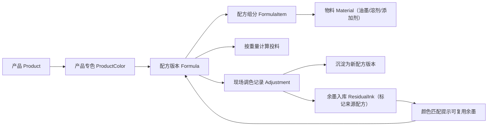
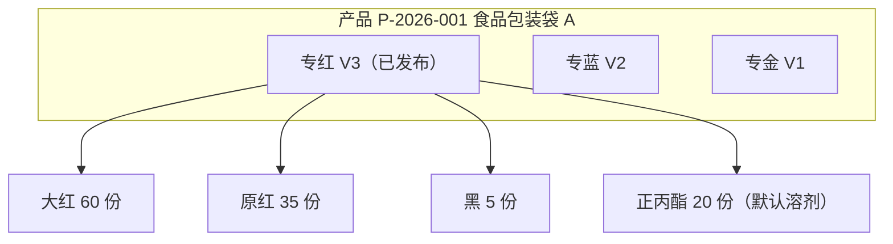
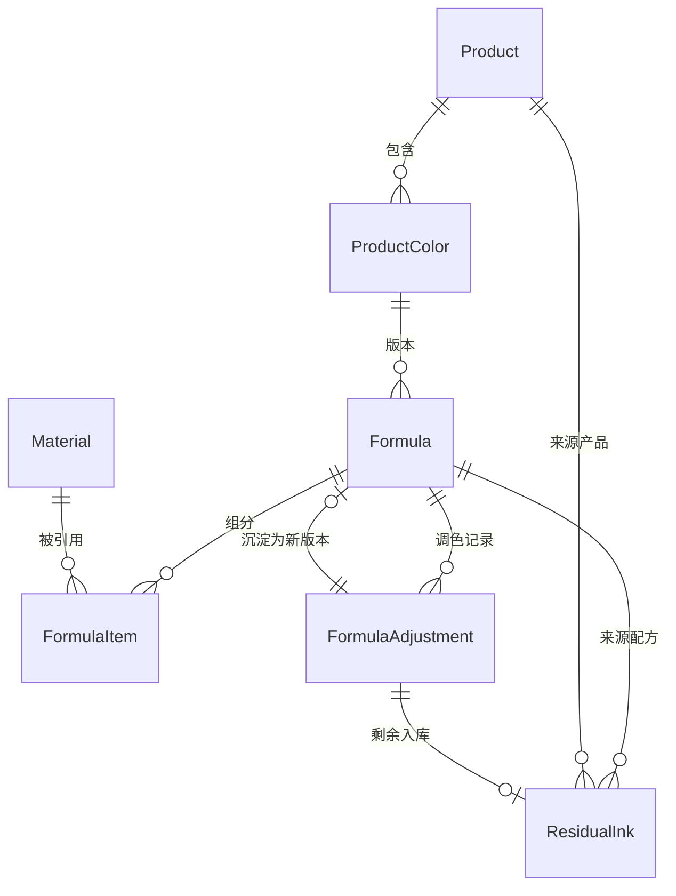
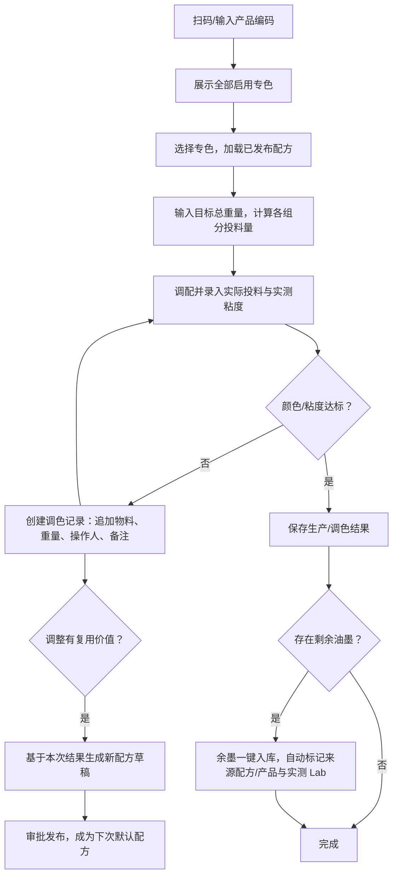

# 凹印颜色配方存储系统

> 文档版本：v0.3  
> 本次更新：技术栈与架构全部落到余墨库存管理系统（residual-ink-management）的现有实现（React / NestJS / Prisma / MariaDB / Tauri）；配方档案作为该系统的新模块扩展，不再独立建设；新增配方 ↔ 余墨库存 ↔ 颜色匹配的联动设计（余墨复用闭环）；数据模型由“类型建议”升级为可直接落地的 Prisma schema。  
> 历史更新（v0.2）：粘度单位统一为 `s`；溶剂默认参与配方；默认溶剂为“正丙酯”。

开发文档 · 需求与系统设计

版本：v0.3 | 状态：设计定稿（待开发） | 日期：2026-08-08

| 项目 | 决策 |
|------|------|
| **开发语言** | TypeScript 全栈（与现有系统一致） |
| **前端** | React + TypeScript + Vite + Ant Design + ECharts（沿用 `apps/web`） |
| **后端** | NestJS + TypeScript（沿用 `apps/api`，新增 `formula.ts` 模块） |
| **ORM** | Prisma（`prisma/schema.prisma`，客户端输出至 `apps/api/src/generated/client`） |
| **数据库** | MariaDB（桌面安装包内置，端口 `39306`），与余墨系统同库 |
| **桌面壳 / 部署** | Tauri 2（Rust）+ NSIS 单 exe 安装包；运行时数据目录 `%LOCALAPPDATA%\ResidualInkManagementRuntime\data` |
| **API 端口** | `39080`（复用现有 API 服务，不新增进程） |
| **测色仪** | X-Rite eXact（沿用现有 `ColorMeasurement` 联机测量能力） |

**核心目标**

在余墨库存管理系统之上，按产品快速匹配多个专色，完整保存专色配方、基础油墨属性、粘度信息、版本历史与现场调色记录，并将调配产生的余墨沉淀回库存、经颜色匹配实现复用闭环。

# 1. 项目概述

## 1.1 建设背景

凹印生产中，一个产品通常包含多个专色。不同产品即使专色名称相同，也可能因为承印材料、客户标准、机台、油墨厂家或工艺条件不同而使用不同配方。依赖纸面、Excel 或个人经验管理时，容易出现配方覆盖、版本混乱、现场调色无法追溯、油墨信息不完整等问题。

企业已上线余墨库存管理系统（余墨建档、出入库、Lab 测色、ΔE 颜色匹配、Pantone 色库、统计看板、权限与审计、Excel 导入导出、桌面一体化安装包）。本系统在**该现有系统基础上扩展配方档案模块**：产品、专色、配方与余墨、测色、匹配数据同库共存，避免另起炉灶造成的账号、权限、备份体系重复建设。

## 1.2 建设目标

- 以“产品”为入口快速匹配其全部专色，并直接查看每个专色当前有效配方。

- 完整保存配方的基础油墨组成、配比、厂家、粘度、备注及适用条件。

- 支持配方版本管理，保证历史生产配方不可被无痕覆盖。

- 支持按目标总重量自动换算各配方物料（油墨、溶剂、添加剂）投料量。

- 保存现场调色、追加油墨、粘度调整及最终结果，为后续配方优化提供依据。

- **余墨复用闭环**：调配/生产剩余油墨一键入余墨库并标记来源配方与产品；颜色匹配命中库存余墨时提示可复用及其来源，降低新墨调配量。

- 为后续成本分析、自动配色等能力预留扩展位置（测色数据已由现有系统提供）。

## 1.3 本期范围

| **范围** | **本期是否包含** | **说明** |
|----------|------------------|----------|
| 产品与专色管理 | 是 | 产品下维护多个专色，支持顺序、备注、工艺参数。 |
| 配方物料资料 | 是 | 维护油墨、溶剂、添加剂；油墨保存厂家、系列、粘度等。 |
| 配方与版本 | 是 | 配方组成、版本、发布/停用、历史查看。 |
| 配方缩放计算 | 是 | 按目标重量计算各组分实际投料量。 |
| 调色/试色记录 | 是 | 记录现场追加与结果，可转为新版本。 |
| 配方 ↔ 余墨联动 | 是 | 调配余墨一键入库并标记来源；匹配结果提示可复用余墨。 |
| 审批与权限 | 基础支持 | 复用现有角色权限模型，区分查看、编辑、发布。 |
| 测色仪自动读取 | 已实现（现有能力） | 沿用 X-Rite 联机测量，配方目标色/调色实测可直接取 Lab。 |
| 自动配色算法 | 暂不实现 | 第一阶段以配方存储、匹配、追溯为主。 |



图 1 核心业务链路（含余墨复用闭环）

# 2. 核心业务概念

| **概念** | **定义** | **示例** |
|----------|----------|----------|
| 产品 Product | 实际生产/销售对应的产品，是配方查询的第一入口。 | P-2026-001 食品包装袋 A |
| 产品专色 ProductColor | 某产品上的一个专色位置或颜色要求。 | 专红、专蓝、专金 |
| 配方 Formula | 某产品专色在特定条件下的一套颜色配比（一个版本一条记录）。 | 专红 V3 |
| 配方组分 FormulaItem | 构成配方的油墨、溶剂或添加剂。 | 大红、原红、黑、正丙酯 |
| 配方物料 Material | 企业可实际领用/调配的油墨、溶剂、添加剂主数据。 | 大红 001、正丙酯 |
| 配方版本 FormulaVersion | 同一产品专色的历史配方版本，由 Formula.versionNo + status 承载。 | V1、V2、V3 |
| 调色记录 Adjustment | 生产现场在标准配方基础上的追加或修正记录。 | 追加黑 0.2kg |
| 余墨 ResidualInk（既有） | 现有余墨库存表；新增来源配方/产品关联后成为复用载体。 | 库位 A01-04 |
| 测色记录 ColorMeasurement（既有） | 现有 X-Rite 联机测色结果；为配方目标色与调色实测提供 Lab 数据。 | L 52.3 / a 48.1 / b 20.5 |

| **关键设计：**“专红”不是全局唯一配方。系统以“产品 + 产品专色 + 配方版本”为实际生产匹配对象，从根本上避免同名专色互相覆盖。 |
|---|



图 2 配方结构示例；图中比例仅用于说明系统结构
# 3. 核心业务规则

## 3.1 产品与专色

**1.** 产品编码必须唯一，建议支持扫码/条码作为快速入口。

**2.** 一个产品可拥有 1 个或多个专色；专色支持排序，以对应印刷色序或版序。

**3.** 产品专色名称可以重复出现在不同产品中，例如多个产品都可以存在“专红”。

**4.** 删除产品时不应物理删除已产生生产记录的数据，应改为停用/归档。

## 3.2 配方版本

**1.** 一个产品专色可拥有多个配方版本，但同一时间最多只有一个“已发布（published）”版本。

**2.** 已发布版本不允许直接修改；任何修改必须复制为新草稿版本，经发布后生效。

**3.** 发布新版本时，旧发布版本在同一事务中自动转为停用（disabled），保证默认配方唯一。

**4.** 草稿（draft）可自由编辑、删除；停用版本只读，仅用于历史追溯。

**5.** 版本号按产品专色内单调递增（V1、V2、V3…），由系统在创建草稿时自动分配。

## 3.3 配方物料

**1.** 油墨、溶剂、添加剂统一存放在物料主数据（Material），以 `materialType` 区分（`ink` / `solvent` / `additive`）。

**2.** 停用物料不得用于新配方，但历史配方必须仍能正常显示（配方发布时已保存关键属性快照）。

**3.** 粘度信息在三个层级保存：物料主数据保存默认值；产品专色/配方保存目标值；调色记录保存实测值。

**4.** 粘度单位全局统一为秒（`s`），数值与测量方式（粘度杯规范）、测量温度分字段保存。

## 3.4 余墨联动（新增）

**1.** 调配/生产结束后如有剩余油墨，应通过调色记录一键入余墨库，不允许只记录配方而不建档余墨。

**2.** 联动入库的余墨自动写入来源产品与来源配方版本（`ResidualInk.formulaId` / `productId`），实测 Lab 可由测色仪直接带入。

**3.** 颜色匹配（现有功能）命中“在库”余墨时，界面标注“可复用余墨”及其来源配方/产品，便于优先消化库存。

**4.** 余墨出库沿用现有出库流程，出库单可通过来源配方/产品筛选统计复用去向。

# 4. 功能清单

| **模块** | **功能** | **说明** |
|----------|----------|----------|
| 产品与专色 | 产品建档、专色维护 | 产品编码唯一；专色排序、目标粘度、工艺备注 |
| 物料管理 | 维护油墨/溶剂/添加剂主数据 | 油墨厂家、系列、粘度；溶剂类型、默认溶剂标记、备注等 |
| 配方管理 | 维护每个产品专色的配方 | 新增配方、编辑草稿、复制版本、发布、停用 |
| 配方计算 | 按目标重量计算投料 | 输入总量，自动生成组分重量 |
| 生产查询 | 根据产品快速获取全部专色配方 | 扫码/搜索产品，查看所有专色 |
| 调色记录 | 记录现场修正 | 追加某油墨、调整量、粘度、结果、备注 |
| 余墨联动 | 调配余墨入库与复用提示 | 余墨标记来源配方；匹配结果标注可复用余墨 |
| 版本审批 | 控制正式配方发布 | 审核、发布、退回、停用 |
| 基础报表 | 查看使用与变化 | 配方历史、油墨使用、调整频次、余墨复用统计 |
| 权限与日志 | 保证追溯 | 复用现有角色权限、操作日志、数据变更记录 |

# 5. 数据模型设计

数据模型以 Prisma schema 表达，命名与类型约定完全遵循现有 `prisma/schema.prisma`：`BigInt` 自增主键、camelCase 字段 + `@map` 蛇形列名、`Decimal` 定点数保存配比/重量/粘度（不使用浮点）、`@db.VarChar` 限定长度、统一 `createdBy/createdAt/updatedBy/updatedAt` 审计字段。新增 6 张表，并对既有 `ResidualInk` 增加 2 个可空外键。



图 3 核心数据关系（ER 图）

## 5.1 product 产品表

```prisma
model Product {
  id             BigInt         @id @default(autoincrement())
  code           String         @unique @db.VarChar(80)          // 产品编码，唯一
  name           String         @db.VarChar(200)
  customerName   String?        @map("customer_name") @db.VarChar(200)
  specification  String?        @db.VarChar(200)
  substrate      String?        @db.VarChar(200)                 // 承印材料
  processNote    String?        @map("process_note") @db.VarChar(1000)
  status         String         @default("启用") @db.VarChar(20) // 启用/停用
  createdBy      String?        @map("created_by") @db.VarChar(80)
  createdAt      DateTime       @default(now()) @map("created_at")
  updatedBy      String?        @map("updated_by") @db.VarChar(80)
  updatedAt      DateTime       @updatedAt @map("updated_at")
  colors         ProductColor[]
  residualInks   ResidualInk[]

  @@map("product")
}
```

## 5.2 product_color 产品专色表

```prisma
model ProductColor {
  id                  BigInt     @id @default(autoincrement())
  productId           BigInt     @map("product_id")
  name                String     @db.VarChar(120)                // 专红/专蓝等
  colorCode           String?    @map("color_code") @db.VarChar(80)
  printOrder          Int?       @map("print_order")             // 印刷色序/显示顺序
  targetColorData     Json?      @map("target_color_data")       // 目标颜色数据（Lab 等，预留）
  targetViscosity     Decimal?   @map("target_viscosity") @db.Decimal(8, 2)
  viscosityUnit       String     @default("s") @map("viscosity_unit") @db.VarChar(10)
  viscosityMethod     String?    @map("viscosity_method") @db.VarChar(120)
  viscosityTemperature Decimal?  @map("viscosity_temperature") @db.Decimal(6, 2)
  remark              String?    @db.VarChar(1000)
  status              String     @default("启用") @db.VarChar(20)
  createdBy           String?    @map("created_by") @db.VarChar(80)
  createdAt           DateTime   @default(now()) @map("created_at")
  updatedBy           String?    @map("updated_by") @db.VarChar(80)
  updatedAt           DateTime   @updatedAt @map("updated_at")
  product             Product    @relation(fields: [productId], references: [id])
  formulas            Formula[]

  @@index([productId], map: "idx_product_color_product")
  @@map("product_color")
}
```

> 说明：同一产品下专色名称不强制唯一（同一产品不同机台/工艺条件是否分别建专色，见 §16.2 待确认项），因此仅建普通索引。

## 5.3 material 配方物料表

统一保存油墨、溶剂和添加剂，配方组分无需针对溶剂设计特殊字段。

```prisma
model Material {
  id                   BigInt        @id @default(autoincrement())
  code                 String        @unique @db.VarChar(80)     // 物料编码，唯一
  name                 String        @db.VarChar(200)
  materialType         String        @map("material_type") @db.VarChar(20) // ink/solvent/additive
  colorFamily          String?       @map("color_family") @db.VarChar(120) // 油墨色系
  manufacturer         String?       @db.VarChar(200)            // 油墨建议必填厂家
  brand                String?       @db.VarChar(120)
  series               String?       @db.VarChar(120)
  defaultViscosity     Decimal?      @map("default_viscosity") @db.Decimal(8, 2)
  viscosityUnit        String        @default("s") @map("viscosity_unit") @db.VarChar(10)
  viscosityMethod      String?       @map("viscosity_method") @db.VarChar(120)
  viscosityTemperature Decimal?      @map("viscosity_temperature") @db.Decimal(6, 2)
  density              Decimal?      @db.Decimal(8, 4)
  unitCost             Decimal?      @map("unit_cost") @db.Decimal(12, 4) // 成本单价预留
  isDefaultSolvent     Boolean       @default(false) @map("is_default_solvent") // 正丙酯
  status               String        @default("启用") @db.VarChar(20)
  remark               String?       @db.VarChar(1000)
  createdBy            String?       @map("created_by") @db.VarChar(80)
  createdAt            DateTime      @default(now()) @map("created_at")
  updatedBy            String?       @map("updated_by") @db.VarChar(80)
  updatedAt            DateTime      @updatedAt @map("updated_at")
  formulaItems         FormulaItem[]

  @@index([materialType], map: "idx_material_type")
  @@index([name], map: "idx_material_name")
  @@map("material")
}
```
## 5.4 formula 配方（版本）表

一个产品专色的每个版本为一条记录；版本状态由 `status` 承载（`draft` / `published` / `disabled`）。

```prisma
model Formula {
  id                   BigInt              @id @default(autoincrement())
  productColorId       BigInt              @map("product_color_id")
  versionNo            Int                 @map("version_no")          // 专色内单调递增
  status               String              @default("draft") @db.VarChar(20) // draft/published/disabled
  basisType            String              @default("份数") @map("basis_type") @db.VarChar(10)
  targetViscosity      Decimal?            @map("target_viscosity") @db.Decimal(8, 2) // 可覆盖专色默认值
  viscosityUnit        String              @default("s") @map("viscosity_unit") @db.VarChar(10)
  viscosityMethod      String?             @map("viscosity_method") @db.VarChar(120)
  viscosityTemperature Decimal?            @map("viscosity_temperature") @db.Decimal(6, 2)
  applicableConditions Json?               @map("applicable_conditions") // 材料/机台/季节/客户等
  changeReason         String?             @map("change_reason") @db.VarChar(1000)
  remark               String?             @db.VarChar(1000)
  createdBy            String?             @map("created_by") @db.VarChar(80)
  createdAt            DateTime            @default(now()) @map("created_at")
  publishedBy          String?             @map("published_by") @db.VarChar(80)
  publishedAt          DateTime?           @map("published_at")
  productColor         ProductColor        @relation(fields: [productColorId], references: [id])
  items                FormulaItem[]
  adjustments          FormulaAdjustment[]
  promotedFrom         FormulaAdjustment[] @relation("promoted_formula")
  residualInks         ResidualInk[]

  @@unique([productColorId, versionNo], map: "uk_formula_version")
  @@index([productColorId, status], map: "idx_formula_color_status")
  @@map("formula")
}
```

## 5.5 formula_item 配方组分表

```prisma
model FormulaItem {
  id                   BigInt   @id @default(autoincrement())
  formulaId            BigInt   @map("formula_id")
  materialId           BigInt   @map("material_id")
  ratioPart            Decimal  @map("ratio_part") @db.Decimal(12, 4)    // 配比份数
  ratioPercent         Decimal? @map("ratio_percent") @db.Decimal(10, 4) // 归一化百分比（缓存）
  sortNo               Int      @default(0) @map("sort_no")
  componentNote        String?  @map("component_note") @db.VarChar(500)
  materialTypeSnapshot String?  @map("material_type_snapshot") @db.VarChar(20)
  manufacturerSnapshot String?  @map("manufacturer_snapshot") @db.VarChar(200)
  viscositySnapshot    String?  @map("viscosity_snapshot") @db.VarChar(200)
  formula              Formula  @relation(fields: [formulaId], references: [id], onDelete: Cascade)
  material             Material @relation(fields: [materialId], references: [id])

  @@index([formulaId], map: "idx_formula_item_formula")
  @@index([materialId], map: "idx_formula_item_material")
  @@map("formula_item")
}
```

> 快照字段在发布时写入：即使物料后续改名、换厂家或停用，已发布配方仍可原样展示。

## 5.6 formula_adjustment 调色记录表

```prisma
model FormulaAdjustment {
  id                    BigInt       @id @default(autoincrement())
  formulaId             BigInt       @map("formula_id")           // 关联原始配方版本
  productionBatchNo     String?      @map("production_batch_no") @db.VarChar(80)
  targetWeight          Decimal?     @map("target_weight") @db.Decimal(12, 3)
  actualViscosityBefore Decimal?     @map("actual_viscosity_before") @db.Decimal(8, 2)
  actualViscosityAfter  Decimal?     @map("actual_viscosity_after") @db.Decimal(8, 2)
  viscosityUnit         String       @default("s") @map("viscosity_unit") @db.VarChar(10)
  adjustmentItems       Json         @map("adjustment_items")     // 追加物料及重量明细
  result                String?      @db.VarChar(40)              // 通过/继续调整/作废
  remark                String?      @db.VarChar(1000)
  createdBy             String?      @map("created_by") @db.VarChar(80)
  createdAt             DateTime     @default(now()) @map("created_at")
  promotedFormulaId     BigInt?      @map("promoted_formula_id")  // 沉淀生成的新版本
  residualInkId         BigInt?      @map("residual_ink_id")      // 剩余油墨联动入库的余墨
  formula               Formula      @relation(fields: [formulaId], references: [id])
  promotedFormula       Formula?     @relation("promoted_formula", fields: [promotedFormulaId], references: [id])
  residualInk           ResidualInk? @relation(fields: [residualInkId], references: [id], onDelete: SetNull)

  @@index([formulaId], map: "idx_adjustment_formula")
  @@index([createdAt], map: "idx_adjustment_time")
  @@map("formula_adjustment")
}
```

## 5.7 既有表改动：residual_ink 增加来源关联

仅在现有 `ResidualInk` 模型上追加两个可空外键，既有数据与功能不受影响：

```prisma
model ResidualInk {
  // ……既有字段保持不变……
  formulaId  BigInt?  @map("formula_id")   // 来源配方版本（可空）
  productId  BigInt?  @map("product_id")   // 来源产品（可空）
  formula    Formula? @relation(fields: [formulaId], references: [id], onDelete: SetNull)
  product    Product? @relation(fields: [productId], references: [id], onDelete: SetNull)
  adjustments FormulaAdjustment[]

  @@index([formulaId], map: "idx_residual_formula")
  @@index([productId], map: "idx_residual_product")
}
```

> 迁移方式：`npm run prisma:push`（`prisma db push`）增量加列加表，既有余墨/出库/测色/账号数据不受影响；新列可空，历史余墨无来源配方属正常。

# 6. 配方计算规则

## 6.1 支持“份数”与“百分比”两种录入方式

配方录入默认使用“份数”，系统自动归一化为百分比。油墨、溶剂和添加剂全部使用同一套计算规则。新建配方草稿时自动带出默认溶剂“正丙酯”（`Material.isDefaultSolvent = true` 的物料）组分，由工艺人员填写实际份数。

| **项目** | **公式/规则** |
|----------|---------------|
| 总份数 | sum = Σ ratio_part |
| 组分百分比 | ratio_percent = ratio_part ÷ sum × 100% |
| 组分投料重量 | component_weight = target_weight × ratio_part ÷ sum |
| 校验 | 发布时所有启用组分份数 > 0；至少 1 种油墨；默认溶剂正丙酯需有有效份数 |
| 精度 | 内部计算使用高精度小数（Prisma `Decimal`），显示精度与称量设备最小分度匹配 |

## 6.2 示例

专红配方（演示）：大红 60 份 + 原红 35 份 + 黑 5 份 + 正丙酯 20 份，总份数为 120。若目标调配量为 20 kg，则系统显示：大红 10.000 kg、原红 5.833 kg、黑 0.833 kg、正丙酯 3.333 kg。

其中正丙酯与油墨完全一样参与总份数和目标重量换算，不在配方计算完成后额外追加。

| **重要：**实际生产配方比例由企业工艺数据维护；文档中的示例比例只用于说明软件计算逻辑。 |
|---|

## 6.3 实际投料与标准配方分离

标准配方用于“应该投多少”，调色记录（`FormulaAdjustment`）用于“实际投了多少”。两者必须分开保存，才能计算偏差、追溯临时修正，并避免把一次现场误差直接污染正式配方。

# 7. 产品匹配与查询逻辑

## 7.1 产品匹配优先级

**1.** 精确匹配产品编码/条码。

**2.** 若无编码，则按产品名称、客户、规格进行组合检索。

**3.** 选择产品后，一次返回该产品所有启用专色。

**4.** 每个专色默认返回“已发布且有效”的配方版本。

**5.** 若存在多套适用条件配方，可根据承印材料、机台等条件进行二次筛选。

**6.** 若没有已发布配方，明确提示“该专色暂无可生产配方”，禁止自动使用草稿。

## 7.2 返回结构建议

查询结果以产品为根节点，内含专色列表；每个专色附带当前配方摘要、目标粘度、版本号和状态。现场页面无需多次进入不同模块搜索。接口形态见 §10。

# 8. 生产与调色流程



图 4 生产查配方与现场调色主流程（含余墨入库分支）

## 8.1 标准生产

**1.** 操作员扫码或输入产品编码。

**2.** 系统展示产品及所有专色。

**3.** 选择专色，系统加载当前已发布配方。

**4.** 输入本次目标总重量，系统计算各组分投料量。

**5.** 操作员按配方调配，并录入/确认实际投料和粘度（实测 Lab 可由 X-Rite 联机测量直接带入）。

**6.** 生产完成后保存记录。

## 8.2 现场调色

**1.** 若颜色或粘度未达到要求，创建调色记录。

**2.** 每次追加必须记录油墨、追加重量、时间、操作人及备注。

**3.** 达到目标后记录最终粘度和结果。

**4.** 若该调整具有重复使用价值，由有权限人员“基于本次结果生成新配方版本”。

**5.** 新版本经过审核/发布后，才成为下次生产默认配方。

## 8.3 余墨入库联动（新增）

**1.** 保存调色/生产记录时，如存在剩余油墨，操作员点击“余墨入库”。

**2.** 系统自动带入：来源产品、来源配方版本、实测 Lab（可由测色仪读取）、建议入库日期；操作员只需指定库位、称重并确认。

**3.** 入库后生成标准 `ResidualInk` 记录（`formulaId` / `productId` 已标记），后续出入库、统计、颜色匹配全部走现有流程。

**4.** 在“颜色匹配”页面检索目标色时，命中“在库”余墨的条目显示“可复用余墨 · 来源：产品/配方版本”，优先消化库存。
# 9. 页面与交互设计

前端沿用现有单页结构（`apps/web/src/LegacyApp.tsx` 的 `PageKey` + 侧边菜单注册），新增两个页面：

| **PageKey** | **菜单名** | **可见权限码** |
|-------------|-----------|----------------|
| `formulas` | 配方档案 | `formula.view` |
| `materials` | 配方物料 | `formula.view` |

菜单注册方式与现有 8 个页面（dashboard / match / inventory / outbound / statistics / users / backup / logs）一致，组件复用 Ant Design Table/Form/Modal、`excel-style-table` 样式与现有 `api()` 请求封装。

## 9.1 产品配方工作台（`formulas`）

- 顶部提供产品编码/名称/客户检索，优先支持扫码。

- 选中产品后，以卡片或列表一次展示全部专色。

- 每个专色显示：名称、当前版本、配方摘要、目标粘度（单位固定 `s`）、状态。

- 点击“查看配方”进入详细页；点击“按重量计算”直接打开投料计算器。

- 每个专色卡片附“可复用余墨”角标：存在来源为本专色且“在库”的余墨时提示数量与库位。

## 9.2 配方详情页

- 头部：产品、专色、版本、状态、适用条件、目标粘度。

- 中部：配方组分表，列出物料编码、名称、类型（油墨/溶剂/添加剂）、厂家、配比、百分比、备注。

- 计算区：输入目标重量，实时计算每种物料投料重量（含正丙酯）。

- 历史区：版本历史、调色记录、发布记录、变更原因。

- 操作区：草稿可编辑；已发布版本仅允许复制新版本/停用，不直接修改。

- 联动区：保存调色记录时提供“余墨入库”按钮（见 §8.3）；调色记录行内显示已入库余墨的库位。

## 9.3 物料资料页（`materials`）

- 支持按编码、名称、厂家、系列、色系、类型筛选。

- 编辑油墨时展示厂家、默认粘度（单位固定显示 `s`）、测量方式、温度、密度、备注等；溶剂维护物料类型及默认溶剂标记（`isDefaultSolvent`，全库仅正丙酯一个）。

- 停用物料不得用于新配方，但历史配方必须仍能正常显示（快照机制，见 §5.5）。

# 10. 接口设计

后端在 `apps/api` 新增 `formula.ts` 模块，写法与 `inventory.ts` 同构：控制器与服务同文件、`PrismaService` 访问数据、`@RequirePermissions('...')` 声明权限码（JWT 全局守卫校验）、`AuditService.write()` 写 `OperationLog`。更新操作统一使用 `PATCH`（与现有接口一致）。模块注册进 `app.module.ts`。

| **方法** | **接口** | **权限码** | **用途** |
|----------|----------|-----------|----------|
| GET | /products | `formula.view` | 产品分页/搜索（编码精确 + 名称/客户/规格组合） |
| POST | /products | `formula.edit` | 新增产品 |
| GET | /products/:id | `formula.view` | 产品详情 + 全部启用专色及当前配方摘要 |
| PATCH | /products/:id | `formula.edit` | 更新产品 |
| POST | /products/:id/colors | `formula.edit` | 新增产品专色 |
| PATCH | /product-colors/:id | `formula.edit` | 更新专色 |
| GET | /materials | `formula.view` | 配方物料分页/搜索 |
| POST | /materials | `material.edit` | 新增油墨/溶剂/添加剂 |
| PATCH | /materials/:id | `material.edit` | 更新配方物料 |
| GET | /product-colors/:id/formulas | `formula.view` | 查看配方版本历史 |
| POST | /product-colors/:id/formulas | `formula.edit` | 创建配方草稿（自动带出默认溶剂正丙酯组分） |
| PATCH | /formulas/:id | `formula.edit` | 编辑草稿（仅 `draft` 状态允许） |
| POST | /formulas/:id/clone | `formula.edit` | 复制为新版本草稿 |
| POST | /formulas/:id/publish | `formula.publish` | 发布配方（事务内停用同专色旧发布版本） |
| POST | /formulas/:id/disable | `formula.publish` | 停用配方 |
| POST | /formulas/:id/calculate | `formula.view` | 按目标重量计算投料量 |
| POST | /formulas/:id/adjustments | `formula.edit` | 创建调色记录（可同请求携带余墨入库信息） |
| GET | /formulas/:id/adjustments | `formula.view` | 查看调色历史 |

**联动相关既有接口扩展：**

- `POST /match/search`（现有颜色匹配）：响应中的在库余墨条目补充 `formulaId` / `productId` / 来源摘要，前端据此显示“可复用余墨”标记（P2）。
- `POST /formulas/:id/adjustments`：请求体允许携带 `residualInk: { storageLocation, weightKg, lStar, aStar, bStar, ... }`，服务端在同一事务内创建调色记录 + 余墨建档，并回写 `FormulaAdjustment.residualInkId`。

## 10.1 配方计算接口请求/响应示例

请求：`POST /formulas/:id/calculate`，体为 `{ "targetWeight": 20 }`（单位 kg）。

响应：

```json
{
  "formulaId": 12,
  "versionNo": 3,
  "basisType": "份数",
  "totalParts": 120,
  "targetViscosity": { "value": 18, "unit": "s", "method": "涂-4 杯", "temperature": 25 },
  "items": [
    { "materialCode": "RED-001", "name": "大红", "materialType": "ink", "manufacturer": "A 厂家", "ratioPart": 60, "ratioPercent": 50, "weightKg": 10.000 },
    { "materialCode": "SOL-001", "name": "正丙酯", "materialType": "solvent", "ratioPart": 20, "ratioPercent": 16.6667, "weightKg": 3.333 }
  ]
}
```

目标粘度单位统一返回 `s`。

# 11. 权限与审计

权限完全复用现有 `Role` / `Permission` / `RolePermission` 表与“用户权限”配置界面，仅新增 4 个权限码（`module = 'formula'`）：

| **权限码** | **说明** |
|-----------|----------|
| `formula.view` | 查看产品、专色、配方、物料资料；配方计算 |
| `formula.edit` | 新增/编辑产品与专色、创建/编辑配方草稿、记录现场调色 |
| `formula.publish` | 审核并发布正式配方、停用旧版本 |
| `material.edit` | 新增/编辑配方物料主数据 |

| **角色建议** | **权限** |
|--------------|----------|
| 查看人员 | `formula.view` |
| 配方编辑人员 | `formula.view` + `formula.edit` |
| 配方审批/发布人员 | `formula.view` + `formula.publish` |
| 系统管理员 | 全部权限 + 基础资料、人员权限、系统配置（现有 `admin` 角色默认全量） |

所有关键操作记录审计日志（现有 `OperationLog`，含操作人、时间、对象、操作类型、变更前/后 JSON 快照），覆盖：新增/修改产品、修改配方物料资料、创建配方、修改草稿、发布/停用配方、调色记录、余墨联动入库。
# 12. 数据校验与异常处理

| **场景** | **处理规则** |
|----------|--------------|
| 产品编码重复 | 禁止保存并提示已存在产品（`product.code` 唯一约束）。 |
| 物料编码重复 | 禁止保存（`material.code` 唯一约束）。 |
| 配方无组分 | 禁止保存/发布。 |
| 组分配比 ≤ 0 | 禁止保存。 |
| 使用停用物料创建新配方 | 禁止选择或保存。 |
| 发布时存在另一个有效版本 | 发布新版本时在同一事务内自动停用旧发布版本。 |
| 尝试修改已发布版本 | 拒绝直接修改（仅 `draft` 可编辑），提示复制为新版本。 |
| 产品无正式配方 | 现场明确显示“暂无已发布配方”，不得回退到草稿。 |
| 粘度单位为空 | 自动补为 `s`；接口返回统一使用 `s`。 |
| 配方缺少溶剂组分 | 新建时自动加入默认正丙酯；发布前必须填写有效份数。 |
| 余墨联动入库缺少库位/重量 | 库位必填（沿用余墨系统规则），重量未知时按现有“重量未知”流程提示确认。 |

# 13. 非功能要求

- 可追溯性：任何用于生产的配方必须能追溯到具体版本、创建人、发布时间和历史变更。

- 一致性：配方发布、停用、版本切换放在事务中处理，避免同时存在多个默认有效版本。

- 精度：配比与重量字段使用 `Decimal` 定点数，不使用浮点数直接存储生产关键值（与现有 `ResidualInk.weightKg` 等字段一致）。

- 性能：产品编码精确查询为高频路径，依赖 `product.code` 唯一索引；产品名称、客户、油墨编码/名称建立检索索引（见 §5）。

- 可用性：生产工作台尽量减少层级，产品 → 专色 → 配方应在 2~3 次操作内完成。

- 安全性：配方属于核心工艺数据，沿用现有 JWT 登录、角色权限、`OperationLog` 审计与登录失败锁定机制。

- 备份：新表与余墨系统同库同部署，随现有 `BackupJob` 备份/恢复能力一并覆盖，无需新增备份机制。

- 扩展性：后续可增加机台、客户标准、成本、自动配色等模块；测色与颜色匹配已由现有系统提供。

# 14. MVP 开发优先级

| **阶段** | **内容** | **目标** |
|----------|----------|----------|
| P0 前置 | 清理 `apps/api/src/main.ts` 调试 console；确认 `web/src/session.ts` 不写入任何敏感信息（见附录 B 现状评估） | 上线前消除已知问题 |
| P0 | Prisma 新增 6 张表 + `ResidualInk` 来源外键；物料、产品/专色、配方 CRUD 与版本发布 | 建立可用的数据主链路 |
| P0 | 配方档案工作台 + 按重量计算（含默认正丙酯） | 现场能够真正查配方并调配 |
| P1 | 调色记录 + 基于调整生成新版本 + 余墨一键入库联动 | 让现场经验与余墨沉淀回系统 |
| P1 | 权限码接入、审批流、审计日志 | 保证正式配方安全 |
| P2 | 颜色匹配“可复用余墨”提示、余墨复用统计、成本报表 | 提升经营与库存价值 |
| P2 | 自动配色扩展 | 进一步数字化闭环 |

# 15. 第一阶段验收标准

**1.** 可以创建一个产品，并为其维护多个专色。

**2.** 可以建立配方物料资料；油墨保存厂家、粘度和备注，粘度单位默认并统一为 `s`。

**3.** 可以为某产品专色创建包含多个油墨及溶剂的配方；新建配方默认加入“正丙酯”，且正丙酯参与比例及重量计算。

**4.** 配方能够保存多个历史版本，已发布版本不能被直接覆盖。

**5.** 根据产品编码可以一次查询该产品所有专色及其当前有效配方。

**6.** 输入目标总重量后，可以正确换算每种配方物料（包括正丙酯）应投重量。

**7.** 可以保存现场调色追加记录、粘度变化和操作人。

**8.** 可以将稳定的现场调整复制/沉淀为新配方版本并发布。

**9.** 停用的物料和旧配方不会丢失历史引用。

**10.** 所有配方发布、停用和重要修改都有操作日志。

**11.**（联动）调色/生产剩余油墨可一键入余墨库，且该余墨可追溯来源产品与配方版本。

**12.**（联动）颜色匹配命中在库余墨时，可看到“可复用余墨”标记及其来源配方/产品。

# 16. 已确认与待确认业务项

## 16.1 已确认规则

| **业务项** | **已确认规则** |
|------------|----------------|
| 粘度单位 | 统一使用秒，默认单位 `s`；数值与测量方式分字段保存。 |
| 溶剂是否参与配方 | 参与正式配方，与油墨一起参与份数、百分比和重量计算。 |
| 默认溶剂 | 正丙酯；新建配方草稿时自动加入该组分（`Material.isDefaultSolvent`）。 |
| 默认溶剂比例 | 暂不写死，由工艺人员录入；发布前必须为有效正数。 |
| 系统形态 | 不作为独立系统建设，作为余墨库存管理系统的配方档案模块扩展，同库、同部署、同账号权限体系。 |
| 余墨联动 | 调配余墨一键入库并标记来源配方/产品；匹配结果提示可复用余墨。 |

## 16.2 待确认业务项

以下内容不影响第一版数据模型方向，但进入详细设计前需要由工艺/生产人员确认：

| **待确认项** | **建议决策方向** |
|--------------|------------------|
| 粘度保存层级 | 油墨主数据保存默认值；产品专色/配方保存目标值；生产记录保存实测值。 |
| 配方比例单位 | 默认“份数”，自动换算百分比；是否允许直接录百分比可配置。 |
| 同一产品不同机台是否不同配方 | 若现实中存在，则将机台/工艺条件纳入配方适用条件。 |
| 是否需要客户颜色标准/Lab/ΔE | 第一期可预留（`ProductColor.targetColorData`），现有测色与 ΔE 匹配能力可直接复用。 |
| 现场实际投料是否强制录入 | 建议生产记录中可选，关键产品可配置为必填。 |
| 余墨入库是否强制 | 建议默认提示但不强制，关键产品可配置为必填。 |

| **当前推荐的 MVP 数据主线：**Product → ProductColor → Formula(version) → FormulaItem → Material；Material 统一承载 Ink / Solvent / Additive，生产现场额外写入 FormulaAdjustment，剩余油墨写入 ResidualInk 并回链配方。这个结构足够支撑第一版，同时不会锁死后续扩展。 |
|---|

# 附录 A：示例业务数据

| **层级** | **示例** |
|----------|----------|
| 产品 | P-2026-001 / 食品包装袋 A |
| 产品专色 | 专红（V3） / 专蓝（V2） / 专金（V1） |
| 专红 V3 | 大红 60 + 原红 35 + 黑 5 + 正丙酯 20（演示） |
| 油墨“大红” | RED-001；A 厂家；系列 X；默认粘度 18 s；备注 |
| 默认溶剂 | 正丙酯；`materialType = solvent`；`isDefaultSolvent = true`；默认参与配方 |
| 现场记录 | 目标 20kg → 追加黑 0.2kg → 最终通过 → 可沉淀 V4 |
| 余墨联动 | V3 调配剩余 3kg → 入库 A01-16，标记来源“P-2026-001 / 专红 V3” → 下次匹配目标红时提示可复用 |

# 附录 B：现有系统现状评估与迁移说明

## B.1 静态审查摘要（code-reviewer，2026-08-08）

对 `apps/` 下 37 个 TypeScript 文件（约 29,315 行）的静态审查结果：

| **级别** | **数量** | **要点** |
|----------|----------|----------|
| 严重 | 1 | `web/src/session.ts` 第 4 行被标记“疑似硬编码敏感信息”；经人工复核为 localStorage 键名常量 `rim-remembered-usernames`，属工具误报。该文件仅持久化登录账号名、绝不写入密码，建议保持此约束并纳入代码审查清单。 |
| 一般 | 4 | `api/src/main.ts` 存在调试 `console` 调用（P0 前置清理）；其余 3 处为 Prisma 生成代码 `generated/client/runtime/library.d.ts` 中的 TODO 标记，属第三方产物，忽略。 |
| 优化建议 | 527 | 主要为生成代码的文件命名/行长风格与少量 var 声明，不影响功能，重构期再处理。 |
| 注释覆盖率 | 5.52% | 偏低，配方模块开发时建议对计算与发布事务逻辑补充注释。 |

## B.2 迁移与共存

- 新增表通过 `npm run prisma:push`（`prisma db push`）增量迁移；`ResidualInk` 新增的两个外键列可空，既有余墨、出库、测色、账号、日志数据不受影响。

- 新模块与旧系统并行运行：不扫描、迁移或覆盖任何旧项目代码与数据。

- 开发与验证沿用现有脚本：`npm run dev`（前后端联调）、`npm run typecheck`、`npm run test`、`npm run desktop:build`（Tauri 安装包）。

- 配方模块自身接口建议补充与 `excel.test.ts` / `match.test.ts` 同级的单元测试（计算规则、发布事务、联动入库）。